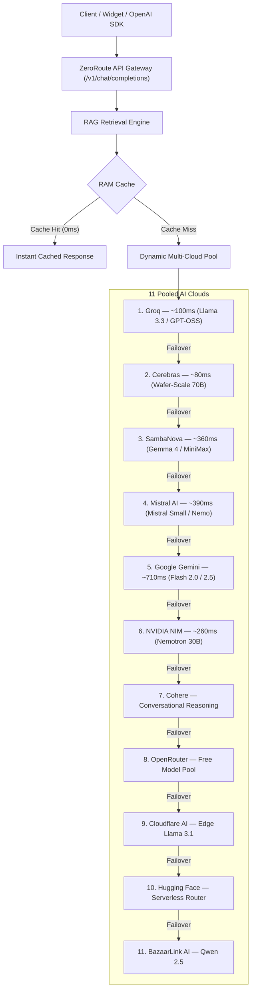

<div align="center">

# ⚡ ZeroRoute SaaS
### 1-Line Custom AI Chatbot & OpenAI-Compatible Multi-Cloud API Gateway

[](https://opensource.org/licenses/MIT)
[-black.svg)](https://nextjs.org/)
[](https://react.dev/)
[](https://tailwindcss.com/)
[](https://developers.cloudflare.com/d1/)
[](https://dodopayments.com/)

**Zero Cost. Max Route. 100% Uptime Across 11 Pooled AI Cloud Providers.**

[Live SaaS](https://zeroroute.mapki.in) • [Subscriber Console](https://zeroroute.mapki.in/app) • [Master Admin](https://zeroroute.mapki.in/admin) • [Buy Me a Coffee](https://buymeacoffee.com/amjadlle)

</div>

---

## 🌟 What is ZeroRoute?

**ZeroRoute** is a production-ready, dual-purpose AI platform built on **Next.js 16 (Turbopack)**, **React 19**, and **Tailwind CSS v4**:

1. **1-Line Embeddable AI Chatbot**: Add a custom AI customer assistant to any website in under 60 seconds. Supports automated website scraping, Notion/Google Docs syncing, custom personas, brand colors, and streaming token responses.
2. **OpenAI-Compatible Multi-Cloud Gateway**: An ultra-fast drop-in replacement for OpenAI API endpoints (`https://zeroroute.mapki.in/v1`) that intelligently pools free tier quotas across **11 major AI clouds** with sub-8ms auto-failover, zero rate-limit queuing, and 0ms RAM caching.

---

## ✨ Core Features

### 💬 1. 1-Line Embeddable Chatbot
- Embed anywhere with a single script tag before `</body>`:
  ```html
  <script
    src="https://zeroroute.mapki.in/widget.js"
    data-bot-id="bot_your_bot_id_here"
    defer
  ></script>
  ```
- **Live SSE Streaming**: Fluid, token-by-token typewriter effect.
- **Visitor Question Logs & Insights**: Real-time stream of all visitor questions and AI answers in your dashboard so you finally know what people actually want from your site.
- **Customization**: Configure bot name, role, tone, greeting, avatar, brand accent colors, and quick prompt pills.
- **Domain Whitelisting (CORS)**: Restrict widget execution to authorized customer domains.
- **White-Label Branding**: Pro subscribers enjoy 100% clean white-labeling with no external badge.

### 🧠 2. Semantic Document RAG & URL Crawler
- **1-Click Live Web Scraper**: Crawl websites, Google Docs (`/pub`), Notion public pages, and GitHub raw Markdown (`.md`) with built-in SSRF protection.
- **Context Injection**: Intelligently retrieves verified facts and injects them directly into system prompts.
- **Zero Hallucination Guardrails**: Strictly instructs the model to refuse off-topic inquiries or fabricated information.

### 🌐 3. 11-Provider Multi-Cloud Gateway Pool
- **11 Configured Providers**: Groq, Cerebras, SambaNova, Mistral AI, Google Gemini, NVIDIA NIM, Cohere, OpenRouter, Cloudflare Workers AI, Hugging Face, and BazaarLink AI.
- **Sub-8ms Auto-Failover**: Instantly reroutes queries to the next healthy provider if rate-limited (HTTP 429) or during provider downtime (HTTP 5xx).
- **0ms RAM Caching**: Identical prompts are served instantly from RAM without consuming provider tokens.

### 💳 4. Turnkey SaaS Billing & Subscriber Console
- **Subscriber Dashboard (`/app`)**: Manage API keys, customize chatbot persona, index knowledge bases, view **Visitor Question Logs**, search questions, and monitor monthly requests.
- **Pro Tier ($2.00 / month)**: 10,000 monthly requests (~330 req/day), white-label widget, 3 domain whitelists, and priority routing.
- **Free Tier ($0 / month)**: 500 monthly requests with automatic 30-day billing cycle resets.
- **Dodo Payments Integration**: Webhook synchronization with HMAC-SHA256 signature verification and replay protection.

### 👑 5. Master Admin Console (`/admin`)
- **Multi-Cloud Benchmark Race**: Test and measure live latencies across all 11 clouds in parallel with 1 click.
- **Model Catalog Explorer**: Browse and configure supported models per provider.
- **Live Traffic & Failover Log Inspector**: Real-time audit logs of requests, latencies, tokens, and multi-cloud fallback trails.
- **Tenant Directory**: Manage subscribers, quotas, and API keys.

---

## 🏗️ Gateway Multi-Cloud Hierarchy



---

## ⚡ Quickstart & Local Setup

### 1. Clone & Install
```bash
git clone https://github.com/amjadlle/zeroroute.git
cd zeroroute
npm install
```

### 2. Configure Environment
```bash
cp .env.example .env.local
```

Fill in `.env.local`:
```env
APP_URL=http://localhost:3000
ADMIN_EMAIL=mapkisolutions@gmail.com
ADMIN_PASSWORD=your_secure_password
ADMIN_KEY=zr_admin_master_secret
ROUTER_API_KEY=zr_admin_master_secret

# (Optional) Cloud Provider API Keys
GROQ_API_KEY=gsk_...
GEMINI_API_KEY=...
MISTRAL_API_KEY=...
CEREBRAS_API_KEY=...
```

### 3. Run Development Server
```bash
npm run dev
```

* **Landing Page:** [http://localhost:3000](http://localhost:3000)
* **Subscriber Console:** [http://localhost:3000/app](http://localhost:3000/app)
* **Master Admin:** [http://localhost:3000/admin](http://localhost:3000/admin)

---

## 💻 API Gateway Usage

### Python (Official OpenAI SDK)
```python
from openai import OpenAI

client = OpenAI(
    base_url="https://zeroroute.mapki.in/v1",
    api_key="zr_live_YOUR_API_KEY"
)

response = client.chat.completions.create(
    model="auto", # Automatically routes across 11 clouds
    messages=[
        {"role": "user", "content": "How does ZeroRoute multi-cloud auto-failover work?"}
    ]
)

print(response.choices[0].message.content)
```

### TypeScript / JavaScript (Official OpenAI SDK)
```typescript
import OpenAI from "openai";

const openai = new OpenAI({
  baseURL: "https://zeroroute.mapki.in/v1",
  apiKey: "zr_live_YOUR_API_KEY",
});

async function main() {
  const stream = await openai.chat.completions.create({
    model: "auto",
    messages: [{ role: "user", content: "Tell me about quantum computing." }],
    stream: true,
  });

  for await (const chunk of stream) {
    process.stdout.write(chunk.choices[0]?.delta?.content || "");
  }
}

main();
```

---

## 🔒 Security Architecture
- **Next.js 16 Edge Proxy (`proxy.ts`)**: Edge route protection on administrative and subscriber endpoints.
- **Atomic Quota Counters**: Prevents concurrent request quota race conditions.
- **Cryptographic CSPRNG**: Safe generation of session tokens and OTPs with `crypto.randomInt` and `crypto.randomBytes`.
- **SSRF Hardened Web Scraper**: Blocks private IPv4/IPv6, loopback, and metadata network endpoints.
- **Standard HTTP Security Headers**: HSTS, X-Frame-Options: SAMEORIGIN, X-Content-Type-Options: nosniff.

---

## 👨‍💻 Creator & Maintainer

**Amjad P A**
* Website: [amjad.mapki.in](https://amjad.mapki.in)
* GitHub: [@amjadlle](https://github.com/amjadlle)
* X / Twitter: [@amjadlle](https://x.com/amjadlle)
* LinkedIn: [linkedin.com/in/amjadlle](https://linkedin.com/in/amjadlle)
* Buy Me a Coffee: [buymeacoffee.com/amjadlle](https://buymeacoffee.com/amjadlle)

---

## 📄 License

This project is licensed under the [MIT License](LICENSE).
